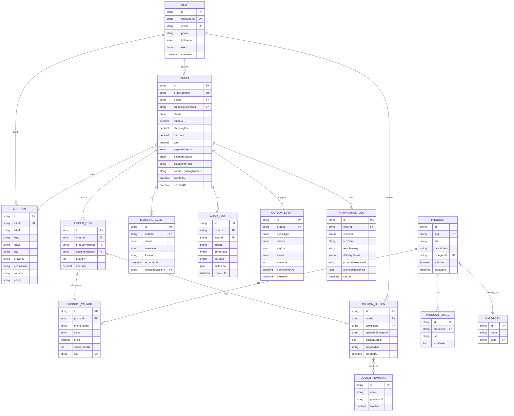

# Database Architecture
## CoverCraft Platform — PostgreSQL + Prisma

**Owner:** Solution Architect / Backend Lead

---

## 1. Overview

- **Engine:** PostgreSQL 15+
- **ORM:** Prisma
- **Migration strategy:** Prisma Migrate, forward-only in production (no destructive down-migrations applied to prod)
- **Naming convention:** `PascalCase` models, `camelCase` fields, Prisma auto-maps to `snake_case` tables/columns via `@@map`/`@map` for SQL-native readability.

---

## 2. Entity Relationship Diagram



---

## 3. Prisma Schema (Core Excerpt)

```prisma
// prisma/schema.prisma

generator client {
  provider = "prisma-client-js"
}

datasource db {
  provider = "postgresql"
  url      = env("DATABASE_URL")
}

enum Role {
  CUSTOMER
  ADMIN
  STAFF
  SUPPORT
}

enum OrderStatus {
  PENDING
  CONFIRMED
  PROCESSING
  PACKED
  SHIPPED
  OUT_FOR_DELIVERY
  DELIVERED
  CANCELLED
  RETURNED
}

enum PaymentMethod {
  COD
  ONLINE
}

enum PaymentStatus {
  PENDING
  PAID
  FAILED
  REFUNDED
}

enum NotificationChannel {
  EMAIL
  WHATSAPP
}

enum NotificationDeliveryStatus {
  QUEUED
  SENT
  DELIVERED
  READ
  FAILED
}

enum OutboxStatus {
  PENDING
  PROCESSING
  SENT
  FAILED
  DEAD_LETTER
}

model User {
  id            String    @id @default(cuid())
  clerkUserId   String    @unique
  email         String    @unique
  phone         String?
  fullName      String
  role          Role      @default(CUSTOMER)
  whatsappOptIn Boolean   @default(true)
  createdAt     DateTime  @default(now())
  updatedAt     DateTime  @updatedAt

  addresses     Address[]
  orders        Order[]
  customDesigns CustomDesign[]

  @@map("users")
}

model Address {
  id         String  @id @default(cuid())
  userId     String
  label      String?
  line1      String
  line2      String?
  city       String
  province   String
  postalCode String?
  country    String  @default("PK")
  phone      String

  user   User    @relation(fields: [userId], references: [id])
  orders Order[]

  @@index([userId])
  @@map("addresses")
}

model Category {
  id       String    @id @default(cuid())
  name     String
  slug     String    @unique
  products Product[]

  @@map("categories")
}

model Product {
  id          String   @id @default(cuid())
  slug        String   @unique
  title       String
  description String
  categoryId  String
  isActive    Boolean  @default(true)
  createdAt   DateTime @default(now())

  category Category         @relation(fields: [categoryId], references: [id])
  variants ProductVariant[]
  images   ProductImage[]

  @@index([categoryId])
  @@map("products")
}

model ProductVariant {
  id            String  @id @default(cuid())
  productId     String
  phoneModel    String
  color         String?
  price         Decimal @db.Decimal(10, 2)
  stockQuantity Int     @default(0)
  sku           String  @unique

  product    Product     @relation(fields: [productId], references: [id])
  orderItems OrderItem[]

  @@index([productId])
  @@map("product_variants")
}

model ProductImage {
  id        String  @id @default(cuid())
  productId String
  url       String
  sortOrder Int     @default(0)

  product Product @relation(fields: [productId], references: [id])

  @@index([productId])
  @@map("product_images")
}

model DesignTemplate {
  id          String   @id @default(cuid())
  name        String
  previewUrl  String
  isActive    Boolean  @default(true)
  createdAt   DateTime @default(now())

  customDesigns CustomDesign[]

  @@map("design_templates")
}

model CustomDesign {
  id                String   @id @default(cuid())
  userId            String
  templateId        String?
  uploadedImageUrl  String?
  designConfig      Json     // crop, position, text layers, filters
  previewUrl        String
  createdAt         DateTime @default(now())

  user       User            @relation(fields: [userId], references: [id])
  template   DesignTemplate? @relation(fields: [templateId], references: [id])
  orderItems OrderItem[]

  @@index([userId])
  @@map("custom_designs")
}

model Order {
  id                     String        @id @default(cuid())
  orderNumber            String        @unique // human-readable e.g. CC-2026-000123
  userId                 String
  shippingAddressId      String
  status                 OrderStatus   @default(PENDING)
  subtotal               Decimal       @db.Decimal(10, 2)
  shippingFee            Decimal       @db.Decimal(10, 2) @default(0)
  discount               Decimal       @db.Decimal(10, 2) @default(0)
  total                  Decimal       @db.Decimal(10, 2)
  paymentMethod          PaymentMethod
  paymentStatus          PaymentStatus @default(PENDING)
  courierProvider        String?       // "MANUAL" today; provider name once integrated
  courierTrackingNumber  String?
  createdAt              DateTime      @default(now())
  updatedAt              DateTime      @updatedAt

  user             User              @relation(fields: [userId], references: [id])
  shippingAddress  Address           @relation(fields: [shippingAddressId], references: [id])
  items            OrderItem[]
  trackingEvents   TrackingEvent[]
  auditLogs        AuditLog[]
  outboxEvents     OutboxEvent[]
  notificationLogs NotificationLog[]

  @@index([userId])
  @@index([status])
  @@index([createdAt])
  @@map("orders")
}

model OrderItem {
  id               String  @id @default(cuid())
  orderId          String
  productVariantId String
  customDesignId   String?
  quantity         Int
  unitPrice        Decimal @db.Decimal(10, 2)

  order          Order          @relation(fields: [orderId], references: [id])
  productVariant ProductVariant @relation(fields: [productVariantId], references: [id])
  customDesign   CustomDesign?  @relation(fields: [customDesignId], references: [id])

  @@index([orderId])
  @@map("order_items")
}

model TrackingEvent {
  id              String      @id @default(cuid())
  orderId         String
  status          OrderStatus
  message         String
  location        String?
  occurredAt      DateTime    @default(now())
  createdByUserId String?     // null if system-generated

  order Order @relation(fields: [orderId], references: [id])

  @@index([orderId, occurredAt])
  @@map("tracking_events")
}

model AuditLog {
  id         String       @id @default(cuid())
  orderId    String
  actorId    String       // admin/staff user id, or "SYSTEM"
  action     String       // e.g. "STATUS_CHANGE", "NOTE_ADDED"
  fromStatus OrderStatus?
  toStatus   OrderStatus?
  metadata   Json?
  createdAt  DateTime     @default(now())

  order Order @relation(fields: [orderId], references: [id])

  @@index([orderId, createdAt])
  @@map("audit_logs")
}

model OutboxEvent {
  id            String              @id @default(cuid())
  orderId       String
  eventType     String              // "ORDER_STATUS_CHANGED"
  channel       NotificationChannel
  payload       Json
  status        OutboxStatus        @default(PENDING)
  attempts      Int                 @default(0)
  nextAttemptAt DateTime            @default(now())
  createdAt     DateTime            @default(now())
  updatedAt     DateTime            @updatedAt

  order Order @relation(fields: [orderId], references: [id])

  @@index([status, nextAttemptAt])
  @@index([orderId])
  @@map("outbox_events")
}

model NotificationLog {
  id                String                     @id @default(cuid())
  orderId           String
  channel           NotificationChannel
  recipient         String
  templateKey       String
  deliveryStatus    NotificationDeliveryStatus @default(QUEUED)
  providerMessageId String?
  providerResponse  Json?
  sentAt            DateTime?
  createdAt         DateTime                    @default(now())

  order Order @relation(fields: [orderId], references: [id])

  @@index([orderId])
  @@index([channel, deliveryStatus])
  @@map("notification_logs")
}
```

---

## 4. Indexing Strategy

| Table | Index | Reason |
|---|---|---|
| `orders` | `status` | Admin queue filters by status constantly |
| `orders` | `createdAt` | Default sort, date-range reports |
| `orders` | `userId` | "My Orders" lookups |
| `tracking_events` | `(orderId, occurredAt)` | Timeline queries, always ordered |
| `audit_logs` | `(orderId, createdAt)` | Per-order audit trail rendering |
| `outbox_events` | `(status, nextAttemptAt)` | Dispatcher polling query (`WHERE status='PENDING' AND nextAttemptAt <= now()`) |
| `notification_logs` | `(channel, deliveryStatus)` | Ops dashboards for delivery health |
| `product_variants` | `sku` (unique) | Inventory lookups |

---

## 5. Data Integrity Rules

1. **Order status transitions are validated at the service layer** using the state machine (`ORDER_MANAGEMENT_SYSTEM.md`), not just at the DB level — Postgres enum guarantees valid *values*, not valid *transitions*.
2. **Every status change is atomic**: `Order.status` update + `TrackingEvent` insert + `AuditLog` insert + `OutboxEvent` insert(s) happen in a single Prisma `$transaction`.
3. **Soft deletes** are used for `Product` (`isActive`) rather than hard deletes, to preserve historical `OrderItem` → `ProductVariant` referential integrity.
4. **Money fields** always use `Decimal(10,2)`, never `Float`, to avoid floating-point rounding errors.
5. **Outbox events are append-only**; failures update `status`/`attempts`/`nextAttemptAt` but the row is never deleted until successfully sent or moved to `DEAD_LETTER`.

---

## 6. Migration Strategy

- All schema changes go through `prisma migrate dev` locally → committed migration SQL → `prisma migrate deploy` in CI/CD against staging, then production.
- **No manual schema edits in production.** Any hotfix must still go through a migration file.
- Additive changes (new nullable columns, new tables) are preferred; breaking changes require a two-step migration (expand → backfill → contract) to avoid downtime.
- Migrations run automatically in the deployment pipeline before the new app version receives traffic (see `DEPLOYMENT_GUIDE.md`).

---

## 7. Backup & Recovery

| Aspect | Policy |
|---|---|
| Automated backups | Daily full snapshot, retained 30 days |
| Point-in-time recovery | Enabled (via managed Postgres provider — Neon/Supabase/RDS) |
| Restore drills | Quarterly restore-to-staging test |
| Audit log retention | Indefinite (compliance + dispute resolution) |
| Notification log retention | 12 months, then archived/cold-stored |

---

## 8. Future Schema Extensions (Non-Breaking Paths)

Reserved for `FUTURE_SCALING_ROADMAP.md` features, designed to slot in without breaking current schema:

- `Warehouse`, `InventoryLocation` — for multi-warehouse stock.
- `ShipmentLabel`, `CourierWebhookEvent` — for real courier API integration artifacts.
- `Return`, `RefundTransaction` — dedicated returns/refunds workflow beyond the current `RETURNED` status flag.
- `Coupon`, `LoyaltyPoint` — marketing/retention features.
