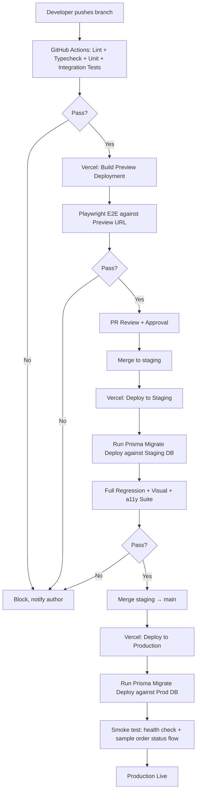

# Deployment Guide
## CoverCraft Platform — Vercel Deployment

**Owner:** DevOps / CTO

---

## 1. Hosting Overview

CoverCraft deploys on **Vercel**, using:
- Vercel's Next.js-native build pipeline (App Router, Server Actions, RSC, Edge/Node runtimes as appropriate).
- Vercel Cron Jobs for the Outbox Dispatcher (`/api/cron/dispatch-outbox`).
- A managed PostgreSQL provider (Neon, Supabase, or Vercel Postgres) reachable from Vercel's serverless functions, connection-pooled (PgBouncer/Prisma Accelerate) to handle serverless connection scaling.

---

## 2. Environments

| Environment | Trigger | Database | Notification Credentials |
|---|---|---|---|
| Local | `pnpm dev` | Local Postgres (Docker) or dev branch of hosted DB | Test/sandbox keys |
| Preview | Every PR push | Ephemeral/shared preview DB (isolated schema or branch DB via Neon branching) | Test/sandbox keys |
| Staging | Merge to `staging` branch | Dedicated staging DB (production-like data volume, synthetic PII) | Test/sandbox keys (real Meta test number, Resend test domain) |
| Production | Merge to `main` (post-approval) | Production DB | Live Resend + Meta credentials |

**Critical rule:** Live WhatsApp/Email credentials exist **only** in the Production environment variable scope in Vercel. Preview/Staging must never have access to production-sending credentials — enforced via separate Vercel Environment Variable scopes (`Production` vs `Preview`/`Development`).

---

## 3. Environment Variables

| Variable | Scope | Notes |
|---|---|---|
| `DATABASE_URL` | All | Pooled connection string (Prisma) |
| `DIRECT_URL` | All | Direct (non-pooled) connection for migrations |
| `CLERK_SECRET_KEY` / `NEXT_PUBLIC_CLERK_PUBLISHABLE_KEY` | All | Per-environment Clerk instance recommended (dev/staging/prod separation) |
| `RESEND_API_KEY` | All (prod = live, others = test) | |
| `WA_ACCESS_TOKEN` | All (prod = live, others = test number) | Meta system user token |
| `WA_PHONE_NUMBER_ID` | All | |
| `WA_APP_SECRET` | All | Used for webhook signature verification |
| `WA_WEBHOOK_VERIFY_TOKEN` | All | Meta webhook handshake |
| `CRON_SECRET` | All | Validates Vercel Cron invocations hit only the intended route |
| `NEXT_PUBLIC_APP_URL` | All | Environment-specific base URL |

All secrets stored in Vercel's encrypted Environment Variables UI — never committed to the repo (see `SECURITY_GUIDE.md` and `.env.example` convention).

---

## 4. Deployment Pipeline



### 4.1 Migration Execution

- `prisma migrate deploy` runs as a **build step** (via Vercel's `buildCommand` or a pre-deploy GitHub Actions job) before the new function code receives traffic — ensuring schema and code version compatibility.
- Migrations are additive-first (see `DATABASE_ARCHITECTURE.md § Migration Strategy`) to avoid requiring downtime windows.

### 4.2 Zero-Downtime Considerations

- Vercel's atomic deployment model (new deployment fully built and health-checked before traffic cutover) provides zero-downtime deploys by default.
- Breaking schema changes use expand/contract migrations across two deploys to avoid a window where old code hits a changed schema.

---

## 5. Cron Jobs

```json
// vercel.json
{
  "crons": [
    {
      "path": "/api/cron/dispatch-outbox",
      "schedule": "* * * * *"
    }
  ]
}
```

The cron route validates an internal `CRON_SECRET` header (set by Vercel automatically for its own cron invocations) to prevent unauthorized external triggering.

---

## 6. Rollback Strategy

| Scenario | Action |
|---|---|
| Bad deploy, no schema change | Instant rollback via Vercel's "Promote previous deployment" |
| Bad deploy, additive schema change | Rollback code; new column/table simply unused — safe |
| Bad deploy, breaking schema change | Should not occur due to expand/contract policy; if it does, roll forward with a corrective migration rather than reverse-migrating production data |

---

## 7. Monitoring Post-Deploy

- Vercel's built-in observability (function logs, error rates, latency) monitored post-deploy.
- Health check endpoint `/api/health` verifies DB connectivity + basic app readiness, checked by an uptime monitor (e.g., Better Uptime/Checkly) pinging every 1–5 minutes.
- Outbox `DEAD_LETTER` count is monitored as a key operational health metric — a spike indicates a notification provider outage requiring attention.

---

## 8. Release Cadence

- **Preview:** continuous, every PR.
- **Staging:** on merge to `staging`, at least daily during active development.
- **Production:** scheduled release windows (e.g., 2×/week) plus emergency hotfix path (see `GITHUB_WORKFLOW.md § Hotfix Process`).

Full branching/release process is detailed in `GITHUB_WORKFLOW.md`.
