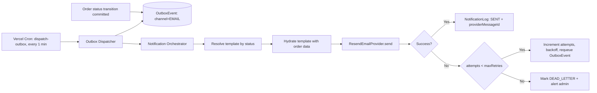

# Email Automation Architecture
## CoverCraft Platform — Resend Integration

**Owner:** Backend Lead

---

## 1. Purpose

Automatically send branded, status-accurate transactional emails for every order lifecycle event, decoupled from the order-update transaction via the outbox pattern, with retries, logging, and failure visibility.

---

## 2. Provider Abstraction

```ts
// lib/domain/notifications/email/email.provider.interface.ts
export interface EmailProvider {
  send(input: {
    to: string;
    subject: string;
    react: React.ReactElement; // React Email component
    tags?: Record<string, string>;
  }): Promise<{ providerMessageId: string }>;
}
```

```ts
// lib/domain/notifications/email/resend.provider.ts
import { Resend } from "resend";

export class ResendEmailProvider implements EmailProvider {
  private client = new Resend(process.env.RESEND_API_KEY);

  async send(input) {
    const { data, error } = await this.client.emails.send({
      from: "CoverCraft <orders@covercraft.com>",
      to: input.to,
      subject: input.subject,
      react: input.react,
      tags: input.tags,
    });
    if (error) throw new EmailSendError(error.message);
    return { providerMessageId: data.id };
  }
}
```

Swapping providers (e.g., to SES or Postmark later) means implementing this interface only — no changes to the Notification Orchestrator or callers.

---

## 3. Template Architecture (React Email)

Templates live in `emails/` and are built with `react-email` components for reliable cross-client HTML rendering.

| Template File | Trigger Status |
|---|---|
| `order-confirmation.tsx` | Order created (`PENDING`) |
| `order-confirmed.tsx` | `CONFIRMED` |
| `order-processing.tsx` | `PROCESSING` |
| `order-packed.tsx` | `PACKED` |
| `order-shipped.tsx` | `SHIPPED` (includes courier name/tracking ref if present) |
| `order-out-for-delivery.tsx` | `OUT_FOR_DELIVERY` |
| `order-delivered.tsx` | `DELIVERED` (+ review/reorder CTA) |
| `order-cancelled.tsx` | `CANCELLED` (+ reason if provided) |
| `order-returned.tsx` | `RETURNED` |

All templates share a common `<EmailLayout>` (logo, brand colors, footer with support contact + unsubscribe link for marketing-adjacent content — transactional emails are exempt from unsubscribe requirements but include a support link).

### 3.1 Template Data Contract

```ts
interface OrderEmailProps {
  customerName: string;
  orderNumber: string;
  status: OrderStatus;
  items: { name: string; phoneModel: string; quantity: number; thumbnailUrl: string }[];
  total: string;               // pre-formatted currency string
  trackingUrl: string;         // deep link to /track or /orders/[id]
  courierName?: string;
  courierTrackingNumber?: string;
  adminNote?: string;          // e.g., cancellation reason
}
```

---

## 4. Trigger & Dispatch Flow



### 4.1 Retry Policy

| Attempt | Backoff |
|---|---|
| 1 | Immediate (first cron pass) |
| 2 | +2 minutes |
| 3 | +10 minutes |
| 4 (final) | +30 minutes |
| After 4 failures | Move to `DEAD_LETTER`, notify admin via internal alert (email to ops + admin dashboard flag) |

Failures **never** roll back or affect the order status — the order record is already committed; only the notification's own state (`OutboxEvent`, `NotificationLog`) reflects delivery issues.

---

## 5. Idempotency

- Each `OutboxEvent` has a unique ID; the dispatcher claims events with an atomic `UPDATE ... WHERE status='PENDING' RETURNING *` (row-level lock) to prevent double-send if multiple cron invocations overlap.
- `NotificationLog.providerMessageId` is stored so any manual investigation can cross-reference Resend's dashboard directly.

---

## 6. Webhook: Delivery Status (Optional Enhancement)

Resend supports delivery/bounce/complaint webhooks. `POST /api/webhooks/email` (future addition) will update `NotificationLog.deliveryStatus` to `DELIVERED`/`FAILED` based on bounce/complaint events, and flag hard-bounced addresses to prevent future sends (protects sender reputation). Signature verification required per Resend's webhook spec — see `SECURITY_GUIDE.md`.

---

## 7. Compliance & Deliverability

- SPF, DKIM, DMARC configured on the sending domain (`covercraft.com`) — required for inbox placement.
- Transactional-only content in status emails (no marketing content mixed in) to protect deliverability classification.
- A dedicated subdomain (e.g., `mail.covercraft.com`) is recommended to isolate transactional sender reputation from any future marketing-email sending.

---

## 8. Testing

- Unit tests mock `EmailProvider` to assert correct template selection per status.
- Staging environment uses a Resend test API key and a controlled recipient allowlist (see `TESTING_STRATEGY.md`).
- Playwright E2E covers the *triggering* logic (status change → OutboxEvent created) — not actual email delivery, which is asserted via provider mocks/log records instead.
