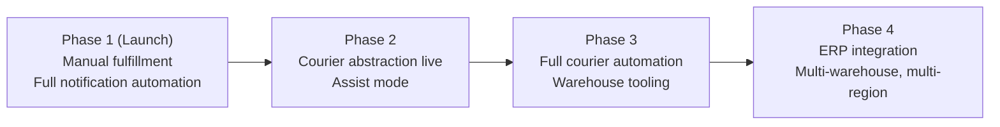
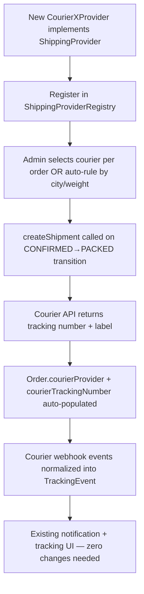

# Future Scaling Roadmap
## CoverCraft Platform

**Owner:** CTO

---

## 1. Purpose

Document the planned evolution from today's **manual, admin-driven fulfillment** model to a progressively automated, integrated operation — without requiring a rewrite, because the architecture (`SYSTEM_ARCHITECTURE.md`) was built with these seams from day one.

---

## 2. Phased Roadmap



| Phase | Trigger Condition | Key Additions |
|---|---|---|
| 1 (Launch) | Day 1 | Everything described in this doc set today |
| 2 | Order volume / ops pain justifies it (~500+ orders/day or repeated manual tracking-entry errors) | First `ShippingProvider` integration (e.g., Leopard) in **assist mode** |
| 3 | Volume/complexity justifies full automation | Full courier webhook automation, basic warehouse/pack-station tooling |
| 4 | Multi-brand/multi-country/high SKU complexity | ERP integration, multi-warehouse inventory routing, financial system sync |

---

## 3. Courier Integration — `ShippingProvider` Abstraction

### 3.1 Interface (already defined in `SYSTEM_ARCHITECTURE.md`)

```ts
export interface ShippingProvider {
  name: string;
  createShipment(order: Order): Promise<ShipmentResult>;
  getTrackingStatus(trackingNumber: string): Promise<TrackingStatus>;
  cancelShipment(trackingNumber: string): Promise<void>;
  supportsWebhooks: boolean;
}
```

### 3.2 Rollout Order (Recommended)

1. **Leopard Courier** — high domestic coverage, commonly used for D2C in the target market; good first integration to validate the abstraction.
2. **TCS** — broader reach, higher reliability for premium SLA orders.
3. **BlueEx** — additional domestic coverage/cost optimization option.
4. **M&P** — regional coverage supplement.
5. **DHL** / **FedEx** — international shipping enablement (required once cross-border orders are supported).

### 3.3 Integration Pattern per Courier



**Key design guarantee:** Because `TrackingEvent`, notification templates, and the customer-facing timeline are already courier-agnostic (manually entered today, webhook-populated tomorrow), integrating a courier is purely additive — an adapter class + a webhook receiver, not a rewrite of `OrderService`, UI, or notification logic.

### 3.4 "Assist Mode" (Phase 2 Transitional State)

Before fully trusting courier webhooks to auto-advance status, Phase 2 runs couriers in **assist mode**: the courier API is used to auto-fetch tracking numbers/labels, but the admin still manually confirms status transitions (reduces risk of trusting unproven webhook reliability). Phase 3 removes this wheel and allows courier webhooks to auto-transition `SHIPPED → OUT_FOR_DELIVERY → DELIVERED`, with admin override always available.

---

## 4. Warehouse & Fulfillment Tooling (Phase 3)

- Barcode/QR-based pack-station flow: staff scan `OrderItem` barcodes to confirm packing accuracy before `PACKED` transition (reduces mis-ships).
- `Warehouse` and `InventoryLocation` models (schema reserved in `DATABASE_ARCHITECTURE.md § 8`) introduced to support multi-location stock once a physical second location exists.
- Pick-list generation for batch order processing during high-volume periods (e.g., sale events).

---

## 5. ERP Integration (Phase 4)

- Sync `Order`, `ProductVariant` (stock), and financial totals to an accounting/ERP system (e.g., Zoho Books, QuickBooks, or a custom ERP) via a dedicated sync service — read/write via scheduled jobs or event-driven webhooks, kept as a **separate bounded context**, not embedded into core order logic.
- Introduces `Return`/`RefundTransaction` as first-class models for structured returns/refund accounting (superseding the simple `RETURNED` status flag).

---

## 6. Multi-Region / Multi-Currency

- `Order` model extended with `currency` and `region` fields; pricing engine (`ProductVariant.price`) becomes region-aware (either per-region price table or FX-rate conversion service).
- Notification templates (Email/WhatsApp) extended with locale/language variants — the existing single-source `status.ts` message map becomes a locale-keyed map, with the same consumption pattern (no structural change to how it's used).
- DHL/FedEx integration (§3.2) becomes required at this stage for international fulfillment.

---

## 7. Notification System Scaling

| Enhancement | When Needed |
|---|---|
| Move outbox dispatch from Vercel Cron (1-min polling) to an event-driven queue (e.g., Upstash QStash, SQS) | When notification volume/latency requirements exceed cron-polling granularity |
| WhatsApp chatbot / auto-reply for common questions ("where is my order") | When inbound message volume becomes significant support burden |
| Multi-language templates | Multi-region launch |
| SMS fallback channel (for customers without WhatsApp) | If market data shows meaningful WhatsApp non-adoption segment |

---

## 8. Real-Time Tracking Upgrade

Once courier webhooks provide higher-frequency updates (Phase 2+), the tracking page can move from polling/revalidation to push-based updates (Server-Sent Events or a lightweight WebSocket channel) for a genuinely "live" tracking experience — schema and UI (`TrackingEvent`, `<TrackingTimeline />`) require no change, only the delivery mechanism to the browser.

---

## 9. Architectural Guardrails for All Future Work

1. Any new integration must implement an existing abstraction interface (`ShippingProvider`, `EmailProvider`, `WhatsAppProvider`, `PaymentProvider`) or propose a new one via ADR — never bypass the abstraction to call a vendor SDK directly from domain services.
2. The order state machine (`ORDER_MANAGEMENT_SYSTEM.md`) remains the single source of truth for valid transitions, even as *who* triggers a transition changes (admin → courier webhook → future auto-rules).
3. Schema changes favor additive evolution (`DATABASE_ARCHITECTURE.md § Migration Strategy`) to keep this roadmap executable without downtime-heavy rewrites.
4. Every phase transition is proposed and recorded as an ADR before implementation begins (`SYSTEM_ARCHITECTURE.md § ADR Process`).
