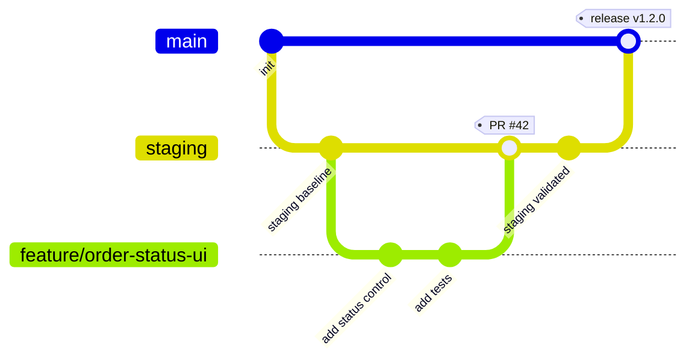

# GitHub Workflow
## CoverCraft Platform — Git & CI/CD Strategy

**Owner:** DevOps / CTO

---

## 1. Branching Model

Trunk-based development with short-lived feature branches:



| Branch | Purpose | Lifespan |
|---|---|---|
| `main` | Production-deployed, always releasable | Permanent |
| `staging` | Pre-production integration/QA branch | Permanent |
| `feature/*` | New features (e.g., `feature/order-status-ui`) | Short-lived, deleted after merge |
| `fix/*` | Non-urgent bug fixes | Short-lived |
| `hotfix/*` | Urgent production fixes, branched from `main` | Short-lived, merged to `main` **and** back-merged to `staging` |

---

## 2. Commit Convention

Conventional Commits, enforced via `commitlint` + a pre-commit hook (Husky):

```
<type>(<scope>): <short description>

[optional body]
[optional footer(s)]
```

| Type | Use |
|---|---|
| `feat` | New feature |
| `fix` | Bug fix |
| `chore` | Tooling, deps, config |
| `docs` | Documentation only |
| `refactor` | No behavior change |
| `test` | Test-only changes |
| `perf` | Performance improvement |

Examples:
```
feat(orders): add bulk status update action
fix(whatsapp): correct template variable order for order_shipped
docs(architecture): add ShippingProvider interface diagram
```

---

## 3. Pull Request Process

1. Branch from `staging` (or `main` for hotfixes).
2. Open PR with a filled template (see §3.1) — draft PRs allowed for WIP/early feedback.
3. Automated checks run (see `DEPLOYMENT_GUIDE.md § 4` pipeline): lint, typecheck, unit, integration, Preview deploy, E2E against Preview.
4. **Minimum 1 approving review** required before merge (2 for changes touching `lib/domain/order/**`, `lib/domain/notifications/**`, or `prisma/schema.prisma` — the highest-risk areas).
5. Squash-merge into `staging` (clean, linear history; PR title becomes the squash commit message, so it must follow Conventional Commits).
6. Delete branch after merge.

### 3.1 PR Template

```markdown
## What
<!-- What does this PR do -->

## Why
<!-- Business/technical motivation -->

## Risk Area
- [ ] Touches order state machine
- [ ] Touches notification (email/WhatsApp) logic
- [ ] Touches database schema
- [ ] Touches auth/RBAC

## Testing
<!-- What tests were added/updated; manual QA steps if applicable -->

## Screenshots (UI changes)
```

---

## 4. Code Ownership

`CODEOWNERS` file enforces mandatory reviewers for sensitive paths:

```
/prisma/schema.prisma            @backend-lead @cto
/lib/domain/order/**             @backend-lead
/lib/domain/notifications/**     @backend-lead
/lib/auth/**                     @cto
/.github/workflows/**            @devops
/docs/**                         @product-manager
```

---

## 5. CI/CD Pipeline (GitHub Actions)

```yaml
# .github/workflows/ci.yml (illustrative)
name: CI
on:
  pull_request:
  push:
    branches: [staging, main]

jobs:
  lint-typecheck:
    runs-on: ubuntu-latest
    steps:
      - uses: actions/checkout@v4
      - uses: pnpm/action-setup@v3
      - run: pnpm install --frozen-lockfile
      - run: pnpm lint
      - run: pnpm typecheck

  unit-integration:
    runs-on: ubuntu-latest
    services:
      postgres:
        image: postgres:15
        env:
          POSTGRES_PASSWORD: test
        ports: ["5432:5432"]
    steps:
      - uses: actions/checkout@v4
      - run: pnpm install --frozen-lockfile
      - run: pnpm prisma migrate deploy
      - run: pnpm test:unit
      - run: pnpm test:integration

  e2e:
    needs: [lint-typecheck, unit-integration]
    runs-on: ubuntu-latest
    steps:
      - uses: actions/checkout@v4
      - run: pnpm install --frozen-lockfile
      - run: pnpm exec playwright install --with-deps
      - run: pnpm test:e2e --config=playwright.preview.config.ts
```

Vercel's native GitHub integration handles Preview/Staging/Production **deployments**; GitHub Actions handles **test gating** before those deployments are considered mergeable/promotable.

---

## 6. Release Process

1. Features accumulate in `staging` via merged PRs.
2. QA Lead signs off on `staging` after full regression suite (`TESTING_STRATEGY.md § 5`, § 7).
3. Release PR: `staging` → `main`, titled `release: vX.Y.Z`, summarizing included changes (auto-generated changelog via `release-please` or similar recommended).
4. Merge triggers production deployment (`DEPLOYMENT_GUIDE.md § 4`).
5. Tag the release in Git (`vX.Y.Z`) for traceability.

### 6.1 Versioning

Semantic Versioning (`MAJOR.MINOR.PATCH`):
- `MAJOR` — breaking schema/API changes requiring coordinated migration.
- `MINOR` — new features, backward compatible.
- `PATCH` — bug fixes, no new functionality.

---

## 7. Hotfix Process

1. Branch `hotfix/*` from `main`.
2. Minimal, targeted fix — no unrelated changes bundled.
3. Expedited review (still requires ≥1 approval; 2 if touching risk areas per CODEOWNERS).
4. Merge to `main` → auto-deploys to production.
5. **Immediately back-merge** `main` → `staging` to prevent drift/regression reintroduction.

---

## 8. GitHub Repository Settings (Required)

- Branch protection on `main` and `staging`: require PR, require status checks to pass, require up-to-date branch before merge, no direct pushes (including admins).
- Required status checks: `lint-typecheck`, `unit-integration`, `e2e`.
- Signed commits recommended for `main`-targeting merges (supply-chain integrity).
- Secrets scanning (GitHub Advanced Security or gitleaks pre-commit hook) enabled to catch accidental credential commits.
