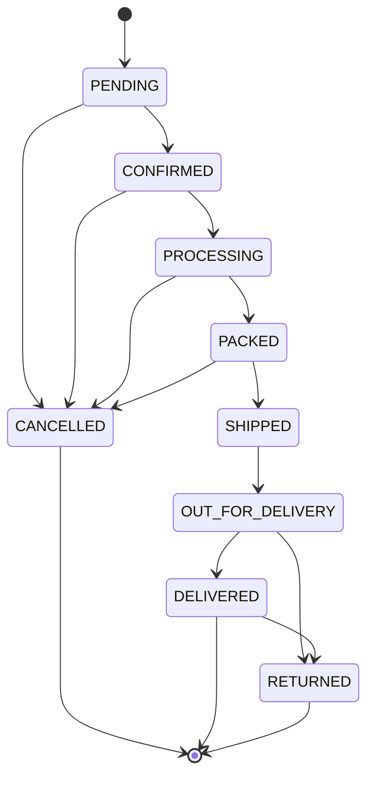
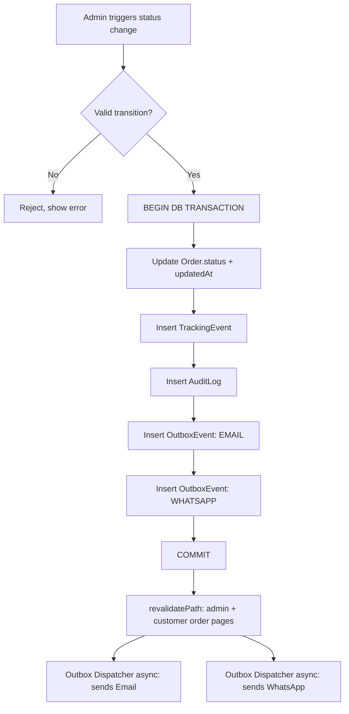

# Order Management System (OMS)
## CoverCraft Platform

**Owner:** Product + Backend Lead

---

## 1. Purpose

The OMS governs the entire lifecycle of an order from creation to terminal state. At launch, **status transitions are 100% manual**, performed by an authenticated Admin/Staff user. The OMS guarantees that every manual transition deterministically triggers a fixed set of automated side effects.

---

## 2. Order Status Set

| Status | Meaning | Terminal? |
|---|---|---|
| `PENDING` | Order placed, awaiting confirmation (e.g., COD verification call, or payment pending) | No |
| `CONFIRMED` | Order verified and accepted for fulfillment | No |
| `PROCESSING` | Custom design being printed/prepared | No |
| `PACKED` | Item packed, ready for courier handoff | No |
| `SHIPPED` | Handed to courier / dispatched | No |
| `OUT_FOR_DELIVERY` | With courier for final-mile delivery | No |
| `DELIVERED` | Successfully delivered to customer | **Yes** |
| `CANCELLED` | Order cancelled (by admin or customer request pre-shipment) | **Yes** |
| `RETURNED` | Order returned post-delivery or refused | **Yes** |

---

## 3. State Machine

### 3.1 Valid Transitions Diagram



### 3.2 Transition Rules

- Transitions are **forward-only** along the defined graph — the UI (`AdminOrderStatusControl`) only ever presents *valid next states* for the current status, computed by `order.state-machine.ts`.
- `CANCELLED` is reachable from any pre-shipment state (`PENDING`, `CONFIRMED`, `PROCESSING`, `PACKED`) but **not** after `SHIPPED` (once with courier, cancellation must be handled as a return instead, since a physical shipment is in motion).
- `RETURNED` is reachable from `OUT_FOR_DELIVERY` (refused at doorstep) or `DELIVERED` (post-delivery return).
- No transition may skip states arbitrarily in v1 (e.g., `PENDING` → `SHIPPED` directly is blocked) to preserve a meaningful tracking timeline. An admin "emergency override" is a Phase 2 consideration (see §7).
- All terminal states (`DELIVERED`, `CANCELLED`, `RETURNED`) are immutable — no further transitions permitted; the order can only be referenced, not altered (refund flows described in `FUTURE_SCALING_ROADMAP.md`).

### 3.3 State Machine Implementation (Reference)

```ts
// lib/domain/order/order.state-machine.ts
export const ORDER_TRANSITIONS: Record<OrderStatus, OrderStatus[]> = {
  PENDING:            ["CONFIRMED", "CANCELLED"],
  CONFIRMED:          ["PROCESSING", "CANCELLED"],
  PROCESSING:         ["PACKED", "CANCELLED"],
  PACKED:             ["SHIPPED", "CANCELLED"],
  SHIPPED:            ["OUT_FOR_DELIVERY"],
  OUT_FOR_DELIVERY:   ["DELIVERED", "RETURNED"],
  DELIVERED:          ["RETURNED"],
  CANCELLED:          [],
  RETURNED:           [],
};

export function canTransition(from: OrderStatus, to: OrderStatus): boolean {
  return ORDER_TRANSITIONS[from]?.includes(to) ?? false;
}
```

The Server Action and the Order Service **both** validate the transition (defense in depth) — the UI restricting choices is a UX convenience, not the security boundary.

---

## 4. The Automated Side-Effect Contract

**This is the core operational guarantee of the platform.** Whenever an admin changes an order's status (via `updateOrderStatus`), the following happens atomically and reliably:



| Effect | Mechanism | Doc Reference |
|---|---|---|
| Database updated | Prisma transaction on `Order` | `DATABASE_ARCHITECTURE.md` |
| Customer dashboard updated | Next.js `revalidatePath`/`revalidateTag` on order pages; client polls/refetches on focus | `SYSTEM_ARCHITECTURE.md` |
| Tracking timeline updated | New `TrackingEvent` row, rendered by `<TrackingTimeline />` | `ORDER_TRACKING_SYSTEM.md` |
| Email sent | `OutboxEvent(channel=EMAIL)` → dispatcher → Resend | `EMAIL_AUTOMATION_ARCHITECTURE.md` |
| WhatsApp sent | `OutboxEvent(channel=WHATSAPP)` → dispatcher → Meta Cloud API | `WHATSAPP_AUTOMATION_ARCHITECTURE.md` |
| Audit log saved | `AuditLog` row: actor, from→to, timestamp, optional note | §5 below |
| Tracking event created | Same `TrackingEvent` row referenced above | `ORDER_TRACKING_SYSTEM.md` |

**Non-negotiable guarantee:** If any part of steps D–H fails, the entire transaction rolls back — the order status never changes without its full audit/tracking/notification trail being queued. Notification *delivery* (actual send to Resend/Meta) is asynchronous and may retry/fail independently without affecting the committed order state (see outbox pattern in `SYSTEM_ARCHITECTURE.md`).

---

## 5. Audit Logging

Every mutation to an order's status writes an `AuditLog` entry containing:

- `actorId` — the admin/staff user ID (or `"SYSTEM"` for automated transitions, if ever introduced)
- `action` — `"STATUS_CHANGE"`
- `fromStatus`, `toStatus`
- `metadata` — optional admin note, IP address, user agent
- `createdAt` — server timestamp (immutable)

Audit logs are **append-only** and exposed via a read-only `<AuditLogTable />` in the admin order detail page. They are never deleted and are the system of record for dispute resolution ("who marked this Delivered and when").

---

## 6. Admin Operations

### 6.1 Single Order Status Update
Standard flow described above via `updateOrderStatus(orderId, newStatus, note?)`.

### 6.2 Bulk Status Update
`updateOrderStatusBulk(orderIds: string[], newStatus, note?)` — validates each order's current status individually; orders that cannot legally transition are skipped and reported back to the admin (partial success with a summary, never a silent failure).

### 6.3 Adding Courier Reference (Manual Mode)
When transitioning to `SHIPPED`, the admin may optionally attach:
- `courierProvider` (free text today, e.g., "Leopard Courier" — manually chosen, not API-integrated)
- `courierTrackingNumber` (free text slip/tracking number from the courier's manual booking)

This data is stored on `Order` and surfaced to the customer in tracking/notifications, **without any live courier API call** — consistent with the "no courier integration yet" constraint. This same field structure is what the future `ShippingProvider` integration will populate automatically (see `FUTURE_SCALING_ROADMAP.md`).

### 6.4 Order Cancellation
Available while in `PENDING`, `CONFIRMED`, `PROCESSING`, or `PACKED`. Requires a mandatory reason (dropdown + free text) stored in `AuditLog.metadata`. Triggers the same full side-effect contract (email/WhatsApp "Your order has been cancelled").

### 6.5 Returns
`RETURNED` transition requires a mandatory reason and is intentionally **not** further subdivided in v1 (e.g., no separate refund workflow yet — refunds are handled manually/offline; see `FUTURE_SCALING_ROADMAP.md` for a dedicated `Return`/`RefundTransaction` model).

---

## 7. Future Enhancements (Roadmap Pointer)

- Emergency admin override to force a non-adjacent transition (with mandatory justification), gated to a `SUPER_ADMIN` role only.
- Auto-transition triggers once courier APIs are integrated (e.g., courier webhook auto-advances `SHIPPED` → `OUT_FOR_DELIVERY` → `DELIVERED`), while still preserving admin override capability.
- SLA timers per status (e.g., alert if an order sits in `PROCESSING` > 48h).

Full detail in `FUTURE_SCALING_ROADMAP.md`.
