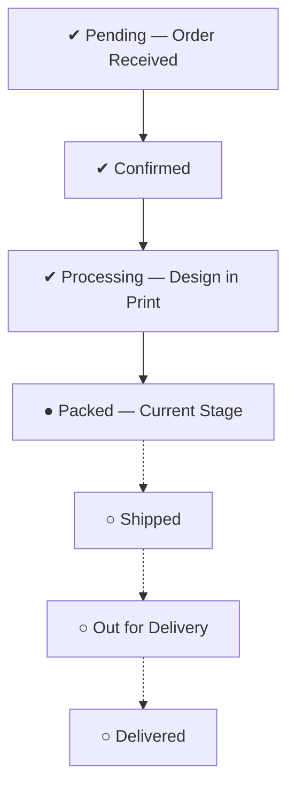
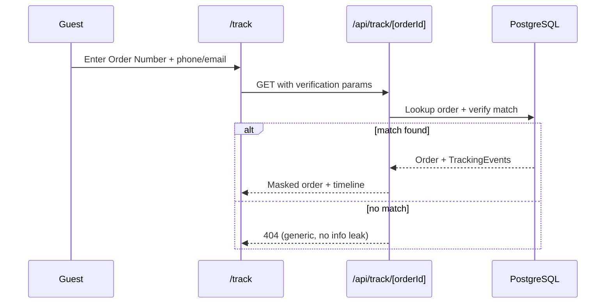

# Order Tracking System
## CoverCraft Platform

**Owner:** Product + Frontend Lead

---

## 1. Purpose

Give customers a real-time-feeling, self-serve view of their order's progress — reducing "where is my order" support load — built entirely from `TrackingEvent` records generated automatically whenever an admin changes order status (see `ORDER_MANAGEMENT_SYSTEM.md`).

---

## 2. Tracking Data Model (Reference)

Each status change produces a `TrackingEvent`:

```ts
interface TrackingEvent {
  id: string;
  orderId: string;
  status: OrderStatus;
  message: string;       // human-readable, e.g. "Your order has been packed and is ready for dispatch"
  location: string | null; // optional, e.g. "Lahore Sorting Facility" (manually entered by admin)
  occurredAt: DateTime;
  createdByUserId: string | null; // admin/staff id
}
```

Tracking events are **never edited or deleted** — the timeline is an append-only ledger, matching the `AuditLog` for consistency (any discrepancy between the two is a data-integrity bug to investigate).

---

## 3. Tracking Timeline UI

### 3.1 Visual Model



- **Completed steps:** filled icon, brand-primary color, timestamp shown.
- **Current step:** highlighted, pulsing/emphasized, `aria-current="step"`.
- **Future steps:** greyed out, no timestamp.
- **Cancelled/Returned:** the timeline switches to a distinct terminal-state layout (red/warning treatment) replacing the "future steps" rail — it does not pretend the normal happy-path steps will still occur.

### 3.2 Status → Message Mapping (Single Source of Truth)

Defined once in `lib/constants/status.ts` and consumed by: tracking timeline, order status badge, email templates, WhatsApp templates.

| Status | Customer-facing Message |
|---|---|
| `PENDING` | "We've received your order and it's awaiting confirmation." |
| `CONFIRMED` | "Your order has been confirmed and will begin processing shortly." |
| `PROCESSING` | "Your custom design is being printed and prepared." |
| `PACKED` | "Your order has been packed and is ready for dispatch." |
| `SHIPPED` | "Your order is on its way!" (+ courier name/tracking ref if available) |
| `OUT_FOR_DELIVERY` | "Your order is out for delivery and will arrive soon." |
| `DELIVERED` | "Your order has been delivered. Enjoy your new cover!" |
| `CANCELLED` | "Your order has been cancelled." (+ reason if provided) |
| `RETURNED` | "Your order has been marked as returned." |

---

## 4. Customer Access Points

### 4.1 Authenticated — "My Orders"
- Requires Clerk session.
- Lists all orders for the logged-in user, each with current status badge.
- Order detail page renders the full `<TrackingTimeline />`.

### 4.2 Guest — Public Tracking Page
- Route: `/track`
- Input: Order Number + verification factor (last 4 digits of phone **or** email used at checkout).
- Rate-limited (see `SECURITY_GUIDE.md`) to prevent order-ID enumeration/scraping.
- Returns the same timeline UI, without exposing other customers' data or full PII (masks address to city-level only).



---

## 5. Real-Time-Feeling Updates

At launch, "real-time" is achieved via:
- `revalidatePath`/`revalidateTag` triggered immediately after the admin's status change (Next.js Server Action → cache invalidation).
- Client-side refetch-on-focus/interval (e.g., SWR/React Query with a 30–60s polling interval) on the order detail and tracking pages while the tab is active.

True push-based real-time (WebSockets/Server-Sent Events) is **not required at launch** given manual, human-paced status changes, but is a documented Phase 2+ enhancement (see `FUTURE_SCALING_ROADMAP.md`) for when courier webhooks introduce higher-frequency automatic updates.

---

## 6. Status Color Mapping

| Status | Color Token |
|---|---|
| `PENDING` | `warning-500` |
| `CONFIRMED` | `info-500` |
| `PROCESSING` | `info-500` |
| `PACKED` | `info-500` |
| `SHIPPED` | `brand-primary` |
| `OUT_FOR_DELIVERY` | `brand-primary` |
| `DELIVERED` | `success-500` |
| `CANCELLED` | `danger-500` |
| `RETURNED` | `danger-500` |

(Defined once, consumed everywhere — see `DESIGN_SYSTEM_REQUIREMENTS.md`.)

---

## 7. Relationship to Future Courier Integration

When a `ShippingProvider` (Leopard, TCS, etc.) is integrated, courier webhook events will be normalized into the **same** `TrackingEvent` model — i.e., a courier's "In Transit" webhook maps to `SHIPPED` or `OUT_FOR_DELIVERY` via a provider-specific adapter, so the customer-facing timeline UI requires **zero changes**. Only the *source* of tracking events changes (admin manual entry → courier webhook), not the schema or UI. See `FUTURE_SCALING_ROADMAP.md § Courier Integration`.
