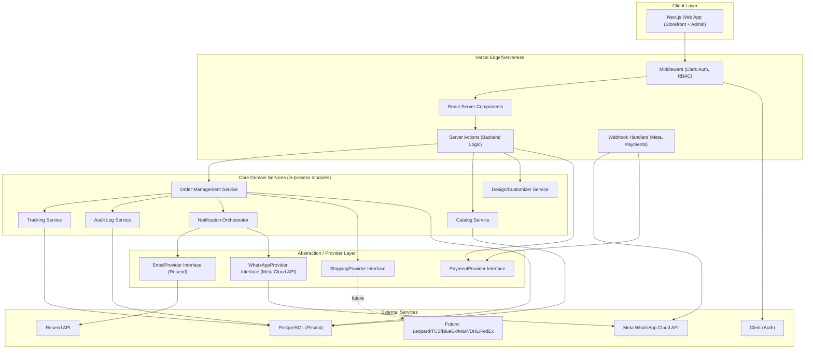
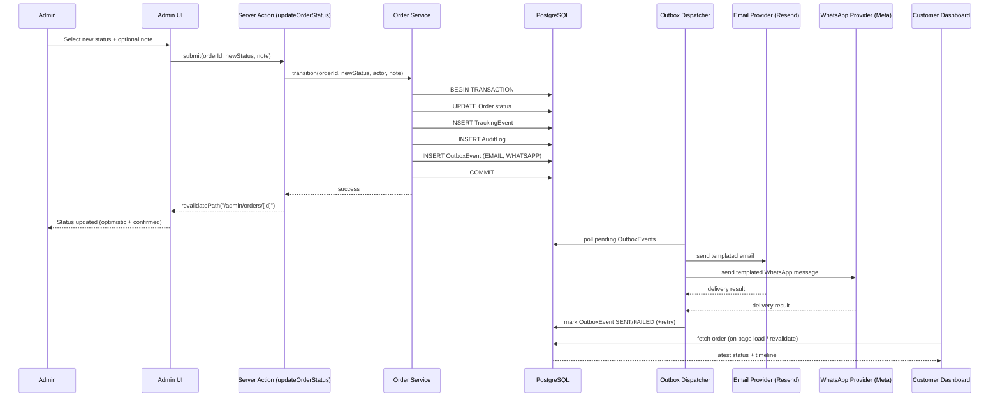
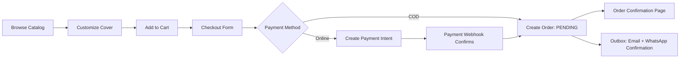
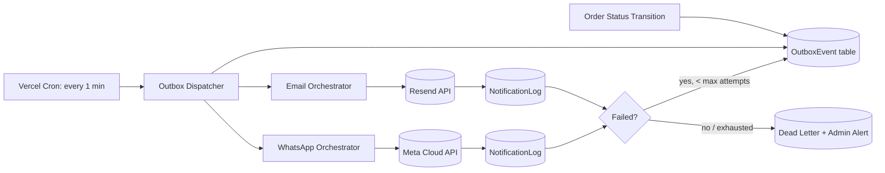

# System Architecture
## CoverCraft Platform

**Owner:** Solution Architect / CTO
**Status:** Baseline v1.0

---

## 1. Architectural Overview

CoverCraft is built as a **modular monolith** on Next.js 15, using Server Actions as the backend, PostgreSQL/Prisma as the data layer, and third-party services (Clerk, Resend, Meta WhatsApp Cloud API) integrated behind internal abstraction layers. This gives startup-speed development with clean seams for future decomposition (see `FUTURE_SCALING_ROADMAP.md`).

### 1.1 High-Level Component Diagram



### 1.2 Design Principles

1. **Server Actions as the API layer.** No separate REST/GraphQL service is needed for the primary app; Server Actions are strongly-typed, colocated with UI, and run in Vercel serverless functions. External consumers (future mobile app, courier webhooks) get a thin `/api/*` Route Handler layer that calls the same internal domain services.
2. **Domain services, not fat components.** Business logic (order transitions, tracking event creation, notification dispatch) lives in `lib/domain/*` service modules — never inline in UI or in Server Actions directly. Server Actions are thin controllers.
3. **Provider interfaces for every external dependency.** Shipping, Email, WhatsApp, and Payment all have a TypeScript interface + one concrete implementation today. Adding a provider = implementing the interface, not modifying callers.
4. **Transactional outbox for side effects.** Status transitions and their side effects (email, WhatsApp, tracking event, audit log) are written in a single DB transaction as an "outbox" record set; a background dispatcher (Vercel Cron / Queue) processes notification sends asynchronously and idempotently, so a slow/failed WhatsApp send never blocks or corrupts the order state.
5. **Everything is idempotent.** Webhook handlers (Meta delivery receipts, payment confirmations) and notification dispatch jobs use idempotency keys to survive retries and duplicate deliveries.

---

## 2. Request/Response & Data Flow

### 2.1 Admin Status Change — End-to-End Flow



**Why an outbox, not direct inline sends:** If Resend or Meta API is slow/down, the admin's status update must still succeed instantly. The outbox pattern decouples "truth changed" from "notifications delivered," with retry logic isolated to the dispatcher.

### 2.2 Customer Checkout Flow (Simplified)



---

## 3. Folder Structure

```
covercraft/
├── app/
│   ├── (storefront)/
│   │   ├── page.tsx                     # Home
│   │   ├── products/
│   │   │   ├── page.tsx                 # Catalog
│   │   │   └── [slug]/page.tsx          # Product detail
│   │   ├── customize/[productId]/page.tsx
│   │   ├── cart/page.tsx
│   │   ├── checkout/page.tsx
│   │   ├── orders/
│   │   │   ├── page.tsx                 # My Orders (auth)
│   │   │   └── [orderId]/page.tsx
│   │   └── track/page.tsx               # Public tracking (guest)
│   │
│   ├── (admin)/
│   │   ├── admin/
│   │   │   ├── layout.tsx               # RBAC-gated layout
│   │   │   ├── orders/
│   │   │   │   ├── page.tsx
│   │   │   │   └── [orderId]/page.tsx
│   │   │   ├── products/page.tsx
│   │   │   ├── templates/page.tsx
│   │   │   └── audit-log/page.tsx
│   │   
│   ├── api/
│   │   ├── webhooks/
│   │   │   ├── whatsapp/route.ts        # Meta delivery + inbound
│   │   │   └── payments/route.ts
│   │   └── cron/
│   │       └── dispatch-outbox/route.ts # Vercel Cron trigger
│   │
│   ├── layout.tsx
│   └── globals.css
│
├── actions/                             # Server Actions (thin controllers)
│   ├── order.actions.ts
│   ├── product.actions.ts
│   ├── design.actions.ts
│   └── auth.actions.ts
│
├── lib/
│   ├── domain/                          # Core business logic
│   │   ├── order/
│   │   │   ├── order.service.ts
│   │   │   ├── order.state-machine.ts
│   │   │   └── order.types.ts
│   │   ├── tracking/
│   │   │   └── tracking.service.ts
│   │   ├── notifications/
│   │   │   ├── notification.orchestrator.ts
│   │   │   ├── email/
│   │   │   │   ├── email.provider.interface.ts
│   │   │   │   └── resend.provider.ts
│   │   │   └── whatsapp/
│   │   │       ├── whatsapp.provider.interface.ts
│   │   │       └── meta-cloud.provider.ts
│   │   ├── shipping/
│   │   │   ├── shipping.provider.interface.ts
│   │   │   └── manual.provider.ts       # Today's "no courier API" implementation
│   │   ├── payments/
│   │   │   ├── payment.provider.interface.ts
│   │   │   └── cod.provider.ts
│   │   └── audit/
│   │       └── audit.service.ts
│   │
│   ├── db/
│   │   ├── prisma.ts                    # Prisma client singleton
│   │   └── outbox.repository.ts
│   │
│   ├── auth/
│   │   └── rbac.ts                      # Role checks
│   │
│   └── utils/
│
├── prisma/
│   ├── schema.prisma
│   └── migrations/
│
├── components/
│   ├── ui/                              # Shadcn primitives
│   ├── storefront/
│   ├── admin/
│   └── shared/
│
├── emails/                              # React Email templates
│   ├── order-confirmed.tsx
│   ├── order-shipped.tsx
│   └── ...
│
├── tests/
│   ├── e2e/                             # Playwright specs
│   └── unit/
│
├── docs/                                 # This documentation set
├── .github/workflows/
├── middleware.ts
└── package.json
```

---

## 4. API Architecture

### 4.1 Internal API Surface (Server Actions)

Server Actions are the primary "API." They are typed, colocated, and validated with Zod schemas. Naming convention: `verbNoun` (e.g., `updateOrderStatus`, `createOrder`, `saveCustomDesign`).

Example contract:

```ts
// actions/order.actions.ts
"use server";

export async function updateOrderStatus(input: {
  orderId: string;
  newStatus: OrderStatus;
  note?: string;
}): Promise<{ success: boolean; error?: string }> {
  const actor = await requireRole(["ADMIN", "STAFF"]);
  return OrderService.transition({ ...input, actorId: actor.id });
}
```

### 4.2 External API Surface (Route Handlers)

Used only where Server Actions cannot apply (webhooks, cron, potential future mobile clients):

| Route | Method | Purpose |
|---|---|---|
| `/api/webhooks/whatsapp` | POST | Meta Cloud API delivery status + inbound message webhook |
| `/api/webhooks/payments` | POST | Payment gateway confirmation webhook |
| `/api/cron/dispatch-outbox` | POST (Vercel Cron) | Processes pending OutboxEvents (email/WhatsApp sends) |
| `/api/track/[orderId]` | GET | Public tracking data (rate-limited, requires verification token/last-4) |

All webhook routes verify signatures (Meta `X-Hub-Signature-256`, payment provider HMAC) before processing — see `SECURITY_GUIDE.md`.

### 4.3 ShippingProvider Abstraction (Future-Ready)

```ts
// lib/domain/shipping/shipping.provider.interface.ts
export interface ShippingProvider {
  name: string; // "MANUAL" | "LEOPARD" | "TCS" | "BLUEEX" | "MP" | "DHL" | "FEDEX"
  createShipment(order: Order): Promise<ShipmentResult>;
  getTrackingStatus(trackingNumber: string): Promise<TrackingStatus>;
  cancelShipment(trackingNumber: string): Promise<void>;
  supportsWebhooks: boolean;
}
```

Today, `ManualShippingProvider` implements this interface trivially (admin manually enters a tracking reference, no external call). When a courier is integrated, a new provider class implements the same interface and is registered in a `ShippingProviderRegistry`, selected per-order (e.g., by city, weight, or admin choice) with **zero changes to `OrderService` or the UI**.

---

## 5. Notification Orchestration Architecture



The Notification Orchestrator is provider-agnostic: it resolves the correct template for `(status, channel)`, hydrates it with order data, and delegates the send to the registered `EmailProvider` or `WhatsAppProvider`. See `EMAIL_AUTOMATION_ARCHITECTURE.md` and `WHATSAPP_AUTOMATION_ARCHITECTURE.md` for full detail.

---

## 6. Environments

| Environment | Purpose | Branch | URL Pattern |
|---|---|---|---|
| Local | Developer machines | any | `localhost:3000` |
| Preview | Per-PR ephemeral deploys | any PR branch | `covercraft-git-<branch>.vercel.app` |
| Staging | Pre-prod validation, QA, Playwright against real integrations (test WhatsApp/Resend keys) | `staging` | `staging.covercraft.com` |
| Production | Live customers | `main` | `covercraft.com` |

Full detail: `DEPLOYMENT_GUIDE.md`.

---

## 7. ADR (Architecture Decision Record) Process

Any significant architectural change (new provider, schema-breaking change, new bounded context) must be documented as an ADR:

```
docs/adr/NNNN-title.md
- Status: Proposed | Accepted | Superseded
- Context
- Decision
- Consequences
```

ADRs are append-only; superseded decisions are marked, not deleted.

---

## 8. Key Non-Functional Targets

| Attribute | Target |
|---|---|
| Availability | 99.9% (Vercel + managed Postgres SLA-backed) |
| P95 page load (storefront) | < 2.5s LCP |
| P95 Server Action latency | < 400ms (excluding external notification sends, which are async) |
| Notification send latency (outbox → dispatch) | < 60s (cron interval) |
| Data durability | Postgres with automated daily backups + PITR |
