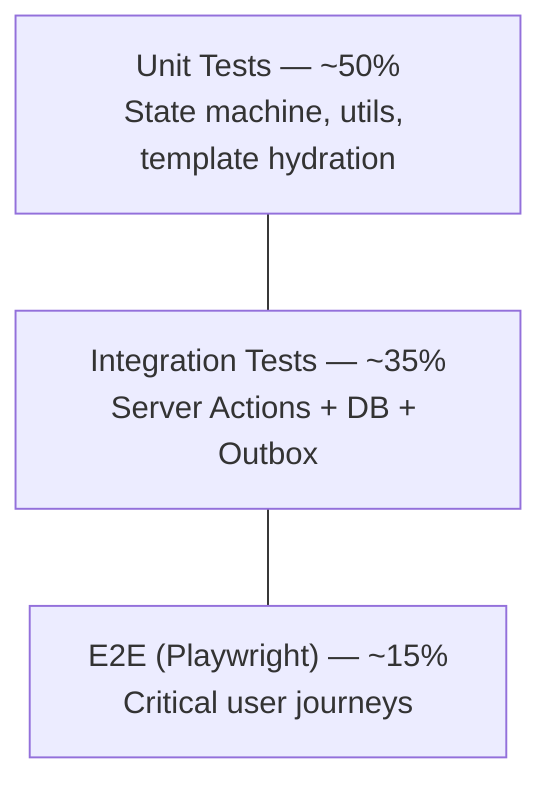

# Testing Strategy
## CoverCraft Platform

**Owner:** QA Lead

---

## 1. Testing Philosophy

Given the order lifecycle's automated side-effect contract is the core risk area (a bug here means customers don't get notified or tracking breaks), testing prioritizes:

1. **State machine correctness** (order transitions) — highest priority, unit-tested exhaustively.
2. **Side-effect completeness** (every transition → DB + tracking + audit + email + WhatsApp outbox entries) — integration-tested.
3. **Critical customer journeys** (browse → customize → checkout → track) — E2E-tested with Playwright.
4. **Visual/regression stability** of the design system — component-level snapshot/visual tests.

---

## 2. Test Pyramid



---

## 3. Unit Testing

**Framework:** Vitest

| Target | What's tested |
|---|---|
| `order.state-machine.ts` | Every valid/invalid transition pair exhaustively (9×9 matrix) |
| `status.ts` (message/color mapping) | Every status has a defined message + color; no missing entries |
| Email/WhatsApp template hydration | Correct variable substitution, missing-field fallbacks |
| Zod validation schemas | Checkout form, admin status-change form — valid/invalid payloads |
| Pricing calculations | Subtotal, discount, shipping, total math (Decimal precision) |

**Coverage target:** ≥ 90% for `lib/domain/**`.

---

## 4. Integration Testing

**Framework:** Vitest + a real (containerized) test PostgreSQL instance via `testcontainers` or a dedicated CI Postgres service, with Prisma migrations applied fresh per run.

| Scenario | Assertion |
|---|---|
| `updateOrderStatus` happy path | `Order.status` updated, `TrackingEvent` inserted, `AuditLog` inserted, 2 `OutboxEvent`s inserted (EMAIL + WHATSAPP), all in one transaction |
| Invalid transition attempt | Rejected before any DB write occurs (no partial side effects) |
| Bulk status update, partial failure | Valid orders updated, invalid ones reported, no cross-contamination |
| Outbox dispatcher | Claims `PENDING` events exactly once even under concurrent invocation (row-lock test) |
| Notification failure retry | Failed send increments `attempts`, respects backoff schedule, eventually dead-letters |
| RBAC enforcement | Non-admin/staff roles cannot call `updateOrderStatus` (Server Action rejects) |
| Guest tracking lookup | Correct order returned only with matching verification factor; wrong factor → 404 |

---

## 5. End-to-End Testing (Playwright)

**Environment:** Staging, against seeded test data and Meta/Resend **test** credentials (never production notification credentials in CI).

### 5.1 Critical Journeys (must pass before every production deploy)

1. **Storefront browse → customize → cart → checkout (COD)** → order confirmation page shows Order Number.
2. **Customer views "My Orders"** → sees order with correct initial status.
3. **Admin logs in → finds order → changes status PENDING→CONFIRMED** → tracking timeline on customer-facing page reflects new status (verified via UI, not just DB).
4. **Admin attempts invalid transition** (blocked via UI — no invalid option selectable; and via direct Server Action call in integration tests).
5. **Guest tracking flow**: enter Order Number + phone last-4 → see masked timeline.
6. **Guest tracking wrong verification** → generic "not found," no data leak.
7. **Cover Designer**: upload image → position/crop → preview renders → added to cart with correct thumbnail.
8. **Order cancellation flow** end-to-end including audit log entry visibility in admin.

### 5.2 Playwright Configuration Principles

- Tests run against **Preview deployments** for PR validation and **Staging** for full regression pre-release.
- Use Playwright's built-in test isolation (fresh browser context per test); seed/reset DB state via API/test-only endpoints guarded behind a `TEST_MODE` environment flag (never enabled in production).
- Visual regression: Playwright screenshot comparisons for key pages (home, PDP, checkout, admin order detail, tracking timeline) to catch unintended design-system drift.
- Accessibility checks: `@axe-core/playwright` integrated into E2E runs for WCAG violations on key pages.

```ts
// tests/e2e/order-status-flow.spec.ts (illustrative)
test("admin status change reflects on customer tracking page", async ({ page, adminPage }) => {
  const order = await seedOrder({ status: "PENDING" });
  await adminPage.goto(`/admin/orders/${order.id}`);
  await adminPage.getByRole("button", { name: "Mark as Confirmed" }).click();
  await expect(adminPage.getByText("Confirmed")).toBeVisible();

  await page.goto(`/track?order=${order.orderNumber}`);
  await page.getByLabel("Phone (last 4 digits)").fill(order.phoneLast4);
  await page.getByRole("button", { name: "Track" }).click();
  await expect(page.getByRole("listitem", { name: /Confirmed/ })).toHaveAttribute("aria-current", "step");
});
```

---

## 6. Notification Testing Boundaries

- **Do not** call live Resend/Meta APIs in CI. Use provider interface mocks for unit/integration tests; use **sandboxed test credentials** only in a manual/scheduled staging smoke test (not blocking PR merges), since these depend on external network/service availability.
- Assert notification *intent* (correct `OutboxEvent` created with correct payload) in automated tests; assert actual *delivery* manually or via a low-frequency scheduled staging check.

---

## 7. CI Gating Rules

| Gate | Blocking? |
|---|---|
| Unit tests pass | Yes — blocks PR merge |
| Integration tests pass | Yes — blocks PR merge |
| Type-check (`tsc --noEmit`) | Yes |
| Lint (ESLint) | Yes |
| E2E critical journeys (Playwright, Preview env) | Yes — blocks merge to `main` |
| Full E2E regression + visual + a11y (Staging) | Yes — blocks promotion to production release |
| Notification live-send smoke test | No — informational, scheduled nightly on staging |

Full CI/CD wiring in `GITHUB_WORKFLOW.md` and `DEPLOYMENT_GUIDE.md`.

---

## 8. Test Data Management

- A `seed.ts` script (Prisma seed) provisions baseline catalog + demo orders across all 9 statuses for QA/demo purposes.
- Test-only Server Actions (e.g., `seedOrder`, `resetTestData`) are compiled **out of production builds** via an environment-gated module (`if (process.env.NODE_ENV === "production") throw ...`) to prevent any possibility of test endpoints reaching prod.

---

## 9. Non-Functional Testing

| Type | Tooling | Frequency |
|---|---|---|
| Performance (Core Web Vitals) | Lighthouse CI in GitHub Actions | Every PR (storefront pages) |
| Load testing (checkout, admin status updates) | k6 or Artillery | Pre-launch, then quarterly |
| Security scanning (dependency vulnerabilities) | `npm audit` / Dependabot / Snyk | Continuous (automated PRs) |
| Accessibility | axe-core (automated) + manual screen-reader pass | Every release / quarterly manual audit |
