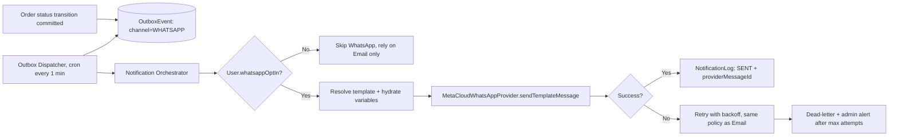
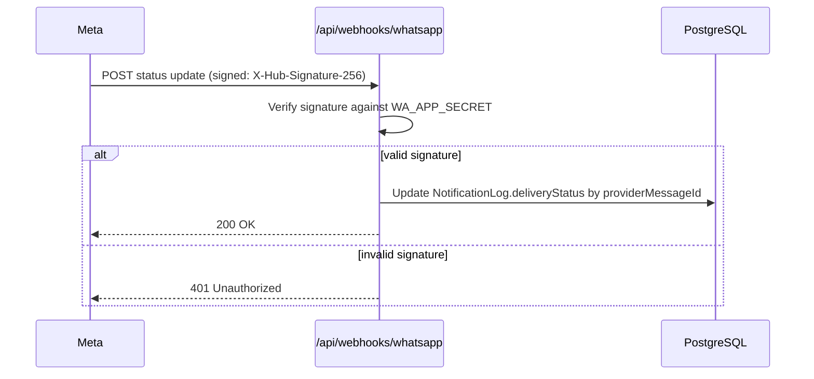

# WhatsApp Automation Architecture
## CoverCraft Platform — Meta WhatsApp Cloud API Integration

**Owner:** Backend Lead

---

## 1. Purpose

Deliver order status updates via WhatsApp — the primary communication channel for the target customer base — using Meta's official WhatsApp Cloud API, with full auditability, opt-out support, and template compliance.

---

## 2. Provider Abstraction

```ts
// lib/domain/notifications/whatsapp/whatsapp.provider.interface.ts
export interface WhatsAppProvider {
  sendTemplateMessage(input: {
    to: string;                // E.164 format
    templateName: string;      // Meta-approved template name
    languageCode: string;      // e.g. "en_US"
    components: WhatsAppTemplateComponent[];
  }): Promise<{ providerMessageId: string }>;
}
```

```ts
// lib/domain/notifications/whatsapp/meta-cloud.provider.ts
export class MetaCloudWhatsAppProvider implements WhatsAppProvider {
  private baseUrl = `https://graph.facebook.com/v20.0/${process.env.WA_PHONE_NUMBER_ID}/messages`;

  async sendTemplateMessage(input) {
    const res = await fetch(this.baseUrl, {
      method: "POST",
      headers: {
        Authorization: `Bearer ${process.env.WA_ACCESS_TOKEN}`,
        "Content-Type": "application/json",
      },
      body: JSON.stringify({
        messaging_product: "whatsapp",
        to: input.to,
        type: "template",
        template: {
          name: input.templateName,
          language: { code: input.languageCode },
          components: input.components,
        },
      }),
    });
    const data = await res.json();
    if (!res.ok) throw new WhatsAppSendError(data.error?.message);
    return { providerMessageId: data.messages[0].id };
  }
}
```

---

## 3. Why Pre-Approved Templates Are Mandatory

Meta's WhatsApp Cloud API **requires** business-initiated messages (outside a 24-hour customer service window) to use **pre-approved Message Templates**. All 9 order-status notifications are business-initiated (customer didn't just message us), so **every status message must be a registered template**, submitted and approved via Meta Business Manager before launch.

### 3.1 Required Templates (submit for approval ahead of launch)

| Template Name | Maps to Status | Variables |
|---|---|---|
| `order_confirmation` | Order created | `{{1}}` customer name, `{{2}}` order number |
| `order_confirmed` | `CONFIRMED` | `{{1}}` order number |
| `order_processing` | `PROCESSING` | `{{1}}` order number |
| `order_packed` | `PACKED` | `{{1}}` order number |
| `order_shipped` | `SHIPPED` | `{{1}}` order number, `{{2}}` courier name, `{{3}}` tracking number |
| `order_out_for_delivery` | `OUT_FOR_DELIVERY` | `{{1}}` order number |
| `order_delivered` | `DELIVERED` | `{{1}}` order number |
| `order_cancelled` | `CANCELLED` | `{{1}}` order number, `{{2}}` reason |
| `order_returned` | `RETURNED` | `{{1}}` order number |

Each template includes a footer CTA button ("Track Order") deep-linking to `/track?order={{orderNumber}}`.

---

## 4. Dispatch Flow



---

## 5. Delivery Status Webhook

Meta sends delivery receipts (`sent`, `delivered`, `read`, `failed`) to a registered webhook.

```
POST /api/webhooks/whatsapp
```



- Verification (`GET` handshake with `hub.verify_token`) is implemented per Meta's webhook setup spec.
- All inbound webhook payloads are logged before processing for auditability/debugging.
- Signature verification is **mandatory** — see `SECURITY_GUIDE.md`.

---

## 6. Opt-In / Opt-Out Management

- At checkout, phone number collection includes a checkbox (checked by default per template-messaging norms, but customer can uncheck): "Send me order updates on WhatsApp."
- `User.whatsappOptIn` boolean gates whether WhatsApp sends are attempted; opted-out customers still receive Email notifications for every status (Email is never optional — see `EMAIL_AUTOMATION_ARCHITECTURE.md`).
- Customers can reply `STOP` to any WhatsApp message; inbound webhook handling detects this and sets `whatsappOptIn = false` automatically, with a confirmation reply.
- Admin panel shows opt-in status per customer for support context.

---

## 7. Inbound Message Handling

Beyond delivery receipts, Meta also forwards **inbound customer messages** (replies) to the same webhook. v1 scope:

- Detect and honor `STOP`/`UNSUBSCRIBE` keywords (compliance-critical).
- All other inbound messages are logged and routed to a support inbox notification — **no chatbot/auto-reply logic in v1** (explicitly out of scope; see `FUTURE_SCALING_ROADMAP.md` for a future WhatsApp support-bot phase).

---

## 8. Retry Policy

Identical backoff schedule to Email (see `EMAIL_AUTOMATION_ARCHITECTURE.md § 4.1`) for consistency of operational tooling — both channels share the same `OutboxEvent`/dead-letter mechanics, differing only in the provider invoked.

---

## 9. Rate Limits & Cost Awareness

- Meta Cloud API enforces messaging tier limits (starts at 1,000 unique customers/24h, scales with quality rating) — the Notification Orchestrator batches/dispatches within these limits and surfaces tier-approaching warnings to admins.
- Each template message is billed per conversation category (utility) by Meta — cost is monitored via a monthly usage report referenced in ops runbooks (see `FUTURE_SCALING_ROADMAP.md` for cost-scaling considerations).

---

## 10. Testing

- Staging uses a Meta Test Number (WhatsApp Business test phone number provided in the Meta App dashboard) — no real customer numbers contacted outside production.
- Template rendering (variable substitution) is unit-tested independently of the live API call.
- E2E (Playwright) verifies that a status change creates the correct `OutboxEvent` payload; actual Meta delivery is verified manually/staging-only, not in automated CI (external network dependency) — see `TESTING_STRATEGY.md`.
